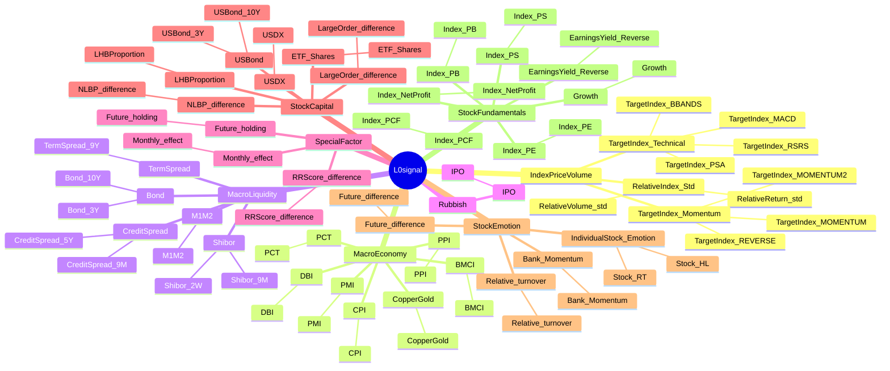

# 信号因子层级结构思维导图



## 文本格式（详细版）

```
================================================================================
信号因子层级结构思维导图
================================================================================

统计信息：
  L1因子数量: 8
  L2因子数量: 36
  L3因子数量: 47

================================================================================

L0signal
│
├── L1: IndexPriceVolume (3个L2因子)
│   ├── L2: RelativeIndex_Std (2个L3因子)
│   │   ├── L3: RelativeReturn_std
│   │   └── L3: RelativeVolume_std
│   ├── L2: TargetIndex_Momentum (3个L3因子)
│   │   ├── L3: TargetIndex_MOMENTUM
│   │   ├── L3: TargetIndex_MOMENTUM2
│   │   └── L3: TargetIndex_REVERSE
│   └── L2: TargetIndex_Technical (4个L3因子)
│       ├── L3: TargetIndex_BBANDS
│       ├── L3: TargetIndex_MACD
│       ├── L3: TargetIndex_PSA
│       └── L3: TargetIndex_RSRS
├── L1: MacroEconomy (7个L2因子)
│   ├── L2: BMCI (1个L3因子)
│   │   └── L3: BMCI
│   ├── L2: CPI (1个L3因子)
│   │   └── L3: CPI
│   ├── L2: CopperGold (1个L3因子)
│   │   └── L3: CopperGold
│   ├── L2: DBI (1个L3因子)
│   │   └── L3: DBI
│   ├── L2: PCT (1个L3因子)
│   │   └── L3: PCT
│   ├── L2: PMI (1个L3因子)
│   │   └── L3: PMI
│   └── L2: PPI (1个L3因子)
│       └── L3: PPI
├── L1: MacroLiquidity (5个L2因子)
│   ├── L2: Bond (2个L3因子)
│   │   ├── L3: Bond_10Y
│   │   └── L3: Bond_3Y
│   ├── L2: CreditSpread (2个L3因子)
│   │   ├── L3: CreditSpread_5Y
│   │   └── L3: CreditSpread_9M
│   ├── L2: M1M2 (1个L3因子)
│   │   └── L3: M1M2
│   ├── L2: Shibor (2个L3因子)
│   │   ├── L3: Shibor_2W
│   │   └── L3: Shibor_9M
│   └── L2: TermSpread (1个L3因子)
│       └── L3: TermSpread_9Y
├── L1: Rubbish (1个L2因子)
│   └── L2: IPO (1个L3因子)
│       └── L3: IPO
├── L1: SpecialFactor (3个L2因子)
│   ├── L2: Future_holding (1个L3因子)
│   │   └── L3: Future_holding
│   ├── L2: Monthly_effect (1个L3因子)
│   │   └── L3: Monthly_effect
│   └── L2: RRScore_difference (1个L3因子)
│       └── L3: RRScore_difference
├── L1: StockCapital (6个L2因子)
│   ├── L2: ETF_Shares (1个L3因子)
│   │   └── L3: ETF_Shares
│   ├── L2: LHBProportion (1个L3因子)
│   │   └── L3: LHBProportion
│   ├── L2: LargeOrder_difference (1个L3因子)
│   │   └── L3: LargeOrder_difference
│   ├── L2: NLBP_difference (1个L3因子)
│   │   └── L3: NLBP_difference
│   ├── L2: USBond (2个L3因子)
│   │   ├── L3: USBond_10Y
│   │   └── L3: USBond_3Y
│   └── L2: USDX (1个L3因子)
│       └── L3: USDX
├── L1: StockEmotion (4个L2因子)
│   ├── L2: Bank_Momentum (1个L3因子)
│   │   └── L3: Bank_Momentum
│   ├── L2: Future_difference (1个L3因子)
│   │   └── L3: Future_difference
│   ├── L2: IndividualStock_Emotion (2个L3因子)
│   │   ├── L3: Stock_HL
│   │   └── L3: Stock_RT
│   └── L2: Relative_turnover (1个L3因子)
│       └── L3: Relative_turnover
└── L1: StockFundamentals (7个L2因子)
    ├── L2: EarningsYield_Reverse (1个L3因子)
    │   └── L3: EarningsYield_Reverse
    ├── L2: Growth (1个L3因子)
    │   └── L3: Growth
    ├── L2: Index_NetProfit (1个L3因子)
    │   └── L3: Index_NetProfit
    ├── L2: Index_PB (1个L3因子)
    │   └── L3: Index_PB
    ├── L2: Index_PCF (1个L3因子)
    │   └── L3: Index_PCF
    ├── L2: Index_PE (1个L3因子)
    │   └── L3: Index_PE
    └── L2: Index_PS (1个L3因子)
        └── L3: Index_PS
```
